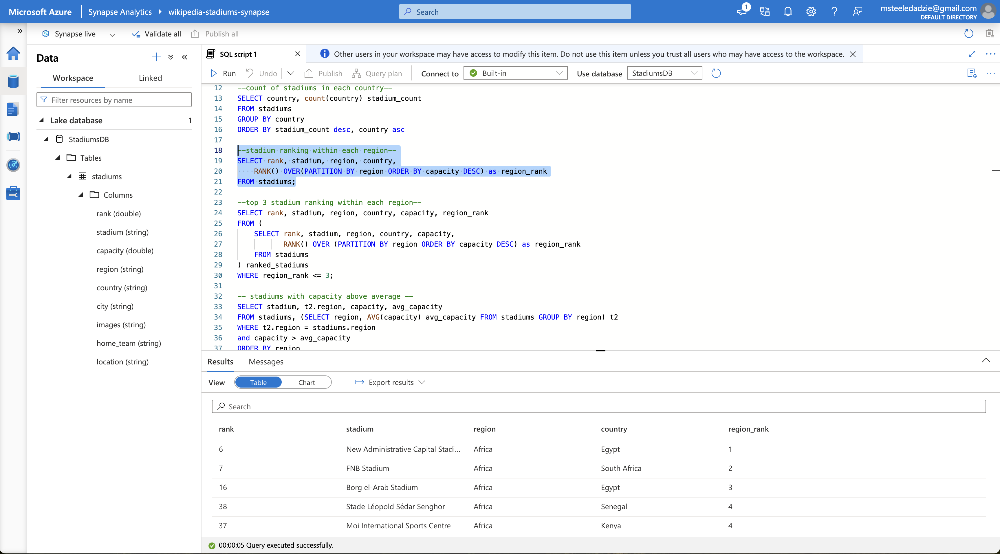

# Wikipedia Stadiums List Data Project

This project is An end-to-end data engineering pipeline that pulls global stadium data from [Wikipedia](https://en.wikipedia.org/wiki/List_of_association_football_stadiums_by_capacity), cleans and transforms this data with Apache Airflow and saves it to an Azure Data Lake. 
Further processing takes place in Azure Data Factory and Azure Synapse.
Data is ultimately visualized via Tableau.

Project composed with aid from tutorial ["Football Data Analytics | Azure End To End Data Engineering Project"](https://www.youtube.com/watch?v=tKIXUqz17W8) by Yusuf Ganiyu.

### Airflow DAGS Graph

### Azure Synapse Processing

### Tableau Visualization

